<div align="center">



<br/>

[](https://git.io/typing-svg)

</div>

---

## 👾 About Me

```typescript
const noa: Developer = {
  education:  "B.Sc. Computer Science — Afeka College of Engineering (2022–2025)",
  background: ["Diploma in Animation & Design", "Freelance Graphic Designer (2019–2022)"],
  focus:      ["Android Dev", "Full-Stack", "AI & Algorithms"],
  languages:  ["Java", "Kotlin", "C++", "Python", "TypeScript", "JavaScript"],
  design:     ["Figma", "Illustrator", "Photoshop", "After Effects"],
  funFact:    "Graphic designer turned engineer 🎨→💻",
};
```

---

## 🛠️ Tech Stack

**Languages**


**Mobile & Frontend**


**Backend & Tools**


**Design**


---

## 🚀 Featured Projects

| Project | Description | Stack |
|--------|-------------|-------|
| 🐾 [**Paws**](https://github.com/noadanon220/paws) | Android pet-care app — manage walks, vet visits & feeding times | `Kotlin` `Firebase` `Jetpack` |
| 🤖 [**AI Tactical Combat Sim**](https://github.com/noadanon220/ai-game-simulation) | 2D strategic AI game with A*, BFS & FSM algorithms | `C++` `OpenGL` |
| 🏦 [**Bank System**](https://github.com/noadanon220/bank-system) | Console banking app with multi-account management | `Java` `OOP` |
| 🧩 [**Rubik's Cube Solver**](https://github.com/noadanon220/rubiks-cube) | Interactive cube simulation with real-time 3D rendering | `C++` `SFML` |
| ✨ [**Gemini Clone**](https://github.com/noadanon220/gemini-clone) | Fully functional AI chat interface with real-time history | `React` `Gen AI SDK` |

---

## 📊 GitHub Stats

<div align="center">

[](https://git.io/streak-stats)

[](https://github.com/noadanon220)

</div>

---

## 🌐 Connect

<div align="center">

[](https://www.linkedin.com/in/noadanon/)
[](https://github.com/noadanon220)
[](https://noadanon220.github.io/noa-danon-portfolio)
[](mailto:noadanon220@gmail.com)

</div>

---

<div align="center">
  
  <br/><br/>
  <sub>built with ♥ — and my dog 🐾</sub>
</div>
